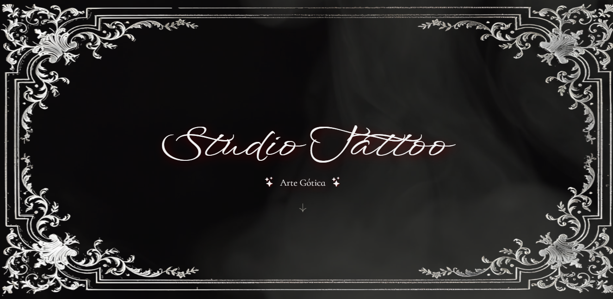

# 🕯️ Studio Tattoo - Website Estético Gótico

Este é um projeto fictício de landing page criado com foco em design, performance e narrativa visual. Inspirado na estética **gótica medieval**, ele foi desenvolvido como parte do meu portfólio como **desenvolvedora web** para mostrar minha capacidade de transformar conceitos visuais intensos e artísticos em experiências digitais impactantes.

## ✨ Sobre o Projeto

O **Studio Tattoo** é um site fictício de uma tatuadora chamada **Aurora Vesper**, especializada em estilos do gótico clássico ao dark ornamental.  
O objetivo foi criar uma atmosfera imersiva, onde cada elemento visual conversa com a proposta estética da personagem e do estúdio.

🔮 A navegação é fluida, com efeitos suaves de transição e um **vídeo de fundo** que remete a um ambiente ritualístico.  
🎨 As imagens do portfólio são exibidas com molduras ornamentadas, reforçando o caráter artístico e simbólico da tatuagem como um **ritual visual**.

> Este projeto não representa um estúdio real. Foi feito como vitrine para as minhas habilidades de desenvolvimento front-end.

---

## 🛠️ Tecnologias Utilizadas

- **HTML5**  
- **CSS3**  
- **Bootstrap Icons**   

---

## 🔍 Funcionalidades

- Efeito de animação fade-in ao iniciar a página (AOS.js)  
- Molduras decorativas em imagens (frames PNG posicionados com CSS)  
- Vídeo de fundo em autoplay  
- Formulário de contato fictício (sem backend, mas funcional visualmente)  
- Estética gótica aplicada à UI e UX

---

## 📸 Prévia

Você pode visualizar o projeto completo no meu portfólio em:  
👉 [https://maddusilva.tech](https://maddusilva.tech)

---
